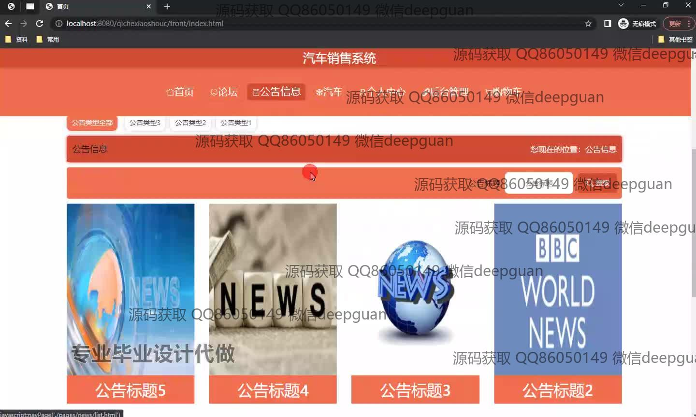
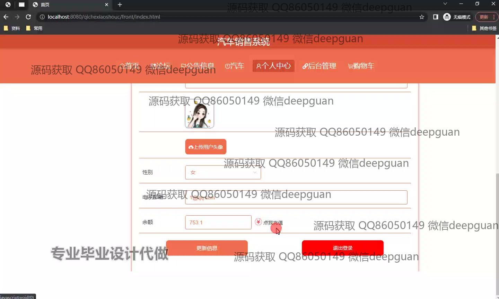

<h1 align="center">基于web的汽车销售系统</h1>

## 简介
汽车销售系统：角色分为管理员、用户；功能包括用户信息管理、汽车列表和购物车管理、订单及汽车评价管理、论坛及公告信息管理、管理员后台管理与基础数据管理。    --计算机毕业设计源码；毕设源码；java毕业设计源码

## 联系方式

<h3 align="center">获取完整代码与数据库文件 + 微信：deepguan QQ: 86050149 QQ群: 783742310</h3>

<h3 align="center">可帮忙远程部署 包运行成功！提供远程部署、修改代码、设计文档指导、代码讲解等服务！</h3>

## 功能介绍（完整见运行截图）
管理员：管理员可以访问主页、个人中心、管理员管理、基础数据管理、论坛管理、公告信息管理、车辆管理和用户管理。主要功能包括管理用户和管理员的信息、审核和管理论坛帖子和回复、维护公告信息、增删改查车辆信息、处理订单管理和查看汽车预订信息。

用户：用户能够注册、登录和退出系统。用户界面提供了主页浏览和汽车列表查看，支持搜索特定车型，查看汽车详情和价格。在个人中心，用户可以编辑个人信息如性别和邮箱，查看账户余额。用户还可以管理购物车，进行订单结算与提交，以及在论坛参与交流，发表和管理帖子回复。

购车者：购车者可以使用系统浏览和搜索不同型号的汽车，查看汽车的详细信息和图片，添加感兴趣的汽车到购物车，并在结算时填写收货信息。购车者还可以在系统内直接对汽车进行评价，评分并提交，同时可以查询和管理个人的订单信息。

评价管理员：评价管理员负责管理用户对汽车的评价，确保信息的准确性和公正性。可以查看和管理每个汽车的评价内容、评分和评价时间，回复用户评价，批量删除不当评价。评价管理员还可以通过查询功能方便地找到特定评价记录，为用户的反馈提供高效的服务处理。

## 运行截图

本代码来源于网络,仅供学习参考使用!

